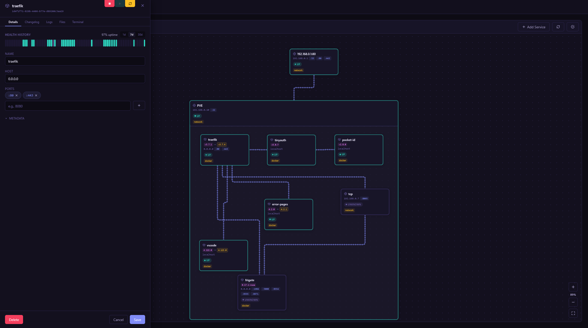
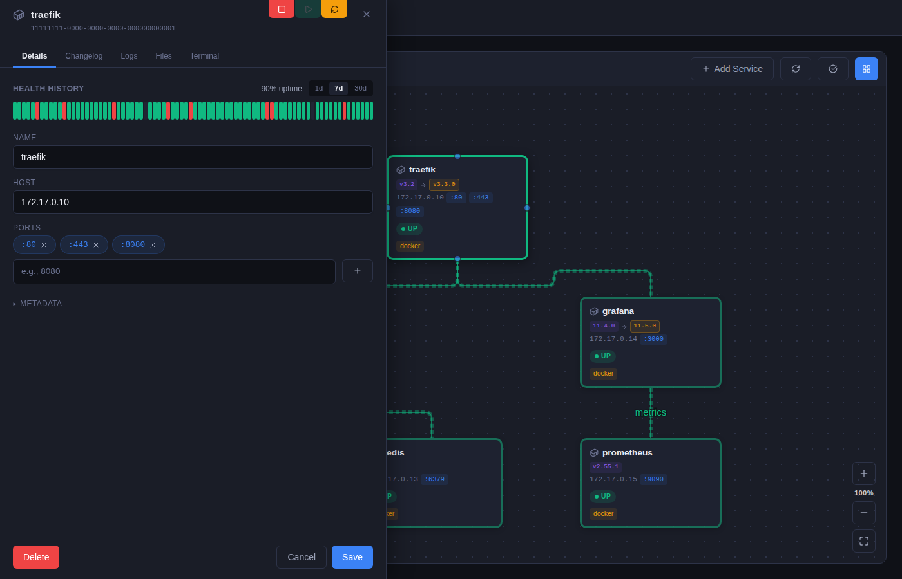
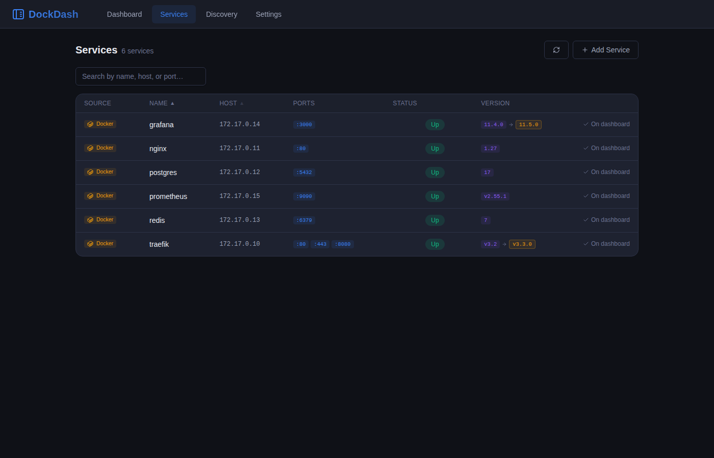
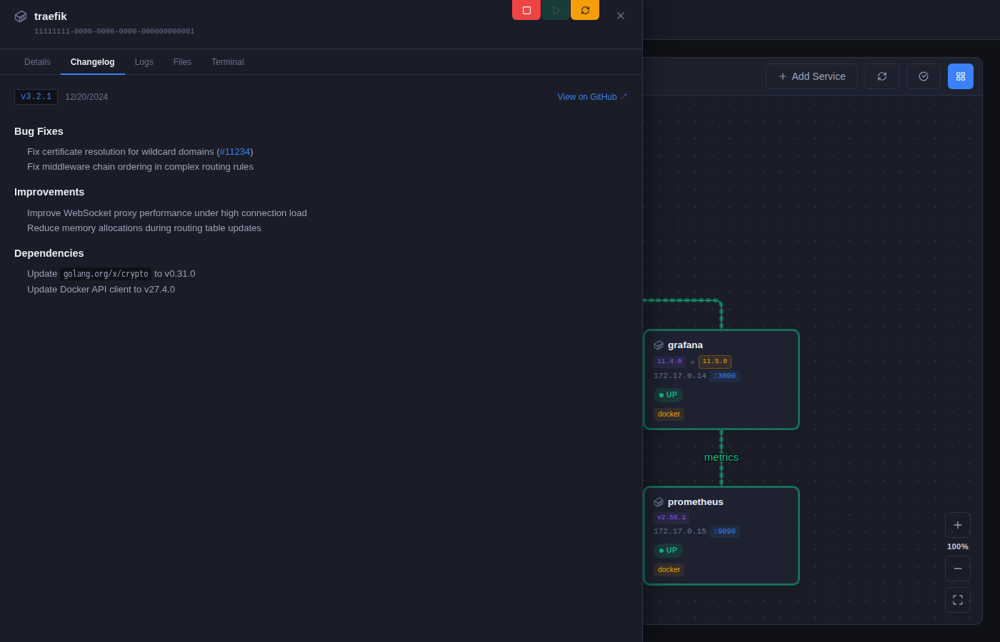

# DockDash

A self-hosted dashboard for visualizing Docker containers and network services. DockDash discovers services automatically, tracks their health, monitors container image updates, and lets you map connections between them on an interactive canvas.

## Features

- **Docker discovery** — scans running containers and exposes their ports as services
- **Network scanning** — port-scans CIDR ranges to find services not managed by Docker
- **Health monitoring** — periodically checks every service and shows live status
- **Health history** — visualizes uptime over the last 1, 7, or 30 days as a color-coded timeline per service
- **Docker logs** — streams live container logs directly in the UI with timestamp parsing and ANSI stripping
- **File explorer** — browse a container's filesystem, view text files, and edit them in place directly from the service drawer
- **Terminal** — interactive shell inside any container via xterm.js; inherits the active UI theme
- **Update monitoring** — checks Docker images against registries and flags outdated containers; update badges refresh automatically without a full page reload
- **Changelog** — fetches GitHub release notes for the running (or available) version of a Docker image and displays them in the service drawer; resolves the GitHub repository via OCI image labels, GHCR URLs, or Docker Hub owner/image heuristics
- **Interactive canvas** — drag nodes, draw connections between services, zoom and pan
- **Themes** — multiple built-in UI themes selectable from the Settings page
- **OIDC authentication** — optional SSO via any standard OpenID Connect provider (Keycloak, Authentik, Authelia, Google, etc.)

## Screenshots



*Interactive canvas — services are auto-grouped by Docker network, connected by drawn links, and annotated with live health badges.*



*Service drawer (Changelog tab) — GitHub release notes fetched automatically for the running image version, including dependency and Docker image changes.*



*Service drawer (Terminal tab) — interactive shell inside any container, themed to match the active UI theme.*



*Service drawer (Files tab) — browse a container's filesystem and view or edit text files directly in the UI.*

## Running with Docker Compose

```yaml
services:
  dockdash:
    image: dockdash
    container_name: dockdash
    restart: unless-stopped
    ports:
      - "3001:3001"
    environment:
      - NETWORK_CIDRS=192.168.0.1/24
    volumes:
      - /var/run/docker.sock:/var/run/docker.sock
      - dockdash-data:/app/data

volumes:
  dockdash-data:
```

A ready-to-use `docker-compose.yml` is included in the repository. Build and start it with:

```bash
docker compose up -d --build
```

The UI is available at `http://localhost:3001`.

## Configuration

All configuration is done via environment variables. Changes require a container restart.

| Variable | Default | Description |
|---|---|---|
| `PORT` | `3001` | Port the server listens on |
| `DOCKER_HOST` | `unix:///var/run/docker.sock` | Docker daemon socket or TCP address |
| `NETWORK_CIDRS` | `192.168.0.1/24` | Comma-separated CIDR ranges to scan |
| `DB_PATH` | `/app/data/dockdash.db` | Path to the SQLite database file |
| `REFRESH_INTERVAL` | `30000` | Discovery refresh interval in milliseconds |
| `HEALTH_CHECK_INTERVAL` | `30000` | How often the server re-checks service health (ms) |
| `UPDATE_CHECK_INTERVAL` | `3600000` | How often to check Docker images for updates (ms) |
| `HEALTH_HISTORY_TTL_DAYS` | `30` | How many days of health check history to retain |
| `LOCALE` | `en` | Language used for server-side notification messages |
| `GITHUB_TOKEN` | — | GitHub personal access token. Required to check for updates to **private** GHCR images (anonymous registry API access only works for public packages). Also increases the GitHub API rate limit when fetching changelogs (unauthenticated requests are limited to 60/hour per IP) |
| `APPRISE_URL` | — | Full notify endpoint of the [Apprise REST API](https://github.com/caronc/apprise-api) server (e.g. `http://apprise:8000/notify/myconfig`) |
| `APPRISE_TAGS` | — | Optional — comma-separated tags to filter which configured Apprise endpoints receive notifications (e.g. `admin`) |
| `APPRISE_URLS` | — | Optional — comma-separated Apprise notification URLs sent inline (e.g. `slack://token/channel`) |
| `DISABLE_CONTAINER_CONTROLS` | — | Set to `true` to hide the Stop / Start / Restart buttons in the service drawer |
| `DISABLE_FILE_EXPLORER` | — | Set to `true` to hide the file explorer tab in the service drawer |
| `DISABLE_TERMINAL` | — | Set to `true` to hide the terminal tab in the service drawer |
| `TRUST_PROXY` | `loopback, uniquelocal` | Express trust proxy setting — controls which `X-Forwarded-*` headers are trusted. The default covers same-host and LAN proxies. Set to `true` to trust all proxies or a specific IP/CIDR for stricter control |
| `OIDC_ISSUER` | — | OIDC provider discovery URL (e.g. `https://auth.example.com/realms/myrealm`); enables authentication when set together with the other `OIDC_*` vars |
| `OIDC_CLIENT_ID` | — | Client ID registered with the OIDC provider |
| `OIDC_CLIENT_SECRET` | — | Client secret registered with the OIDC provider |
| `OIDC_REDIRECT_URI` | — | Callback URL override — auto-detected from the request as `<protocol>://<host>/auth/callback`; only needed if your reverse proxy setup causes incorrect detection |
| `OIDC_SCOPES` | `openid profile email` | Space-separated scopes to request from the provider |
| `SESSION_SECRET` | — | Secret used to sign session cookies — **required in production when OIDC is enabled** |

### Docker socket

Mount the host socket into the container so DockDash can inspect running containers:

```
-v /var/run/docker.sock:/var/run/docker.sock
```

### Remote Docker host

To connect to a remote Docker daemon instead of the local socket, set `DOCKER_HOST`:

```
DOCKER_HOST=tcp://192.168.1.100:2375
```

TLS is supported via the standard `DOCKER_TLS_CERTDIR` variable.

### Network scanning

Set `NETWORK_CIDRS` to one or more comma-separated CIDR ranges. DockDash uses nmap to first discover live hosts via a ping sweep, then scans all 65535 TCP ports on each host:

```
NETWORK_CIDRS=192.168.0.1/24,10.0.0.0/16
```

### Notifications (Apprise)

DockDash can send push notifications when services go down, recover, or have Docker image updates available. It integrates with the [Apprise REST API](https://github.com/caronc/apprise-api), a self-hosted sidecar that forwards notifications to 80+ services (Slack, Discord, Telegram, email, etc.).

Set `APPRISE_URL` to the full notify endpoint of your Apprise server. The path encodes the config key for stateful mode (`/notify/{key}`).

If you use tag-based routing on the Apprise side, set `APPRISE_TAGS` to match:

```
APPRISE_URL=http://192.168.7.5:8000/notify/apprise
APPRISE_TAGS=admin
```

`APPRISE_URLS` is optional — use it to add extra inline notification targets (Slack, Discord, etc.) without pre-configuring them on the Apprise server:

```
APPRISE_URL=http://apprise:8000/notify
APPRISE_URLS=slack://tokenA/tokenB/tokenC/#channel,discord://webhook_id/webhook_token
```

All three variables can be combined.

Once configured, the **Settings** page shows a "Send Test" button to verify delivery. Notifications are sent for:

- Service goes **down** (failure alert)
- Service **recovers** after being down (success alert)
- Docker image **update available** (warning alert)

## Development

Environment variables can be defined in a `.env` file at the project root. See [`.env.example`](.env.example) for available options.

```bash
yarn install
yarn dev        # starts both Vite (port 8081) and the Express server (port 3001)
yarn typecheck  # type-check client and server
yarn lint:fix   # auto-fix lint and formatting
```