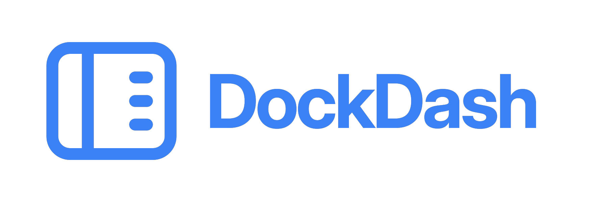
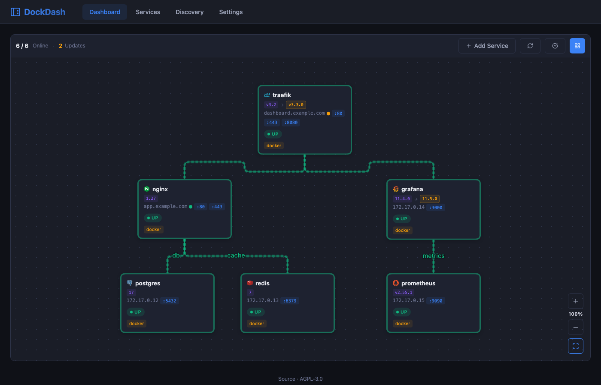
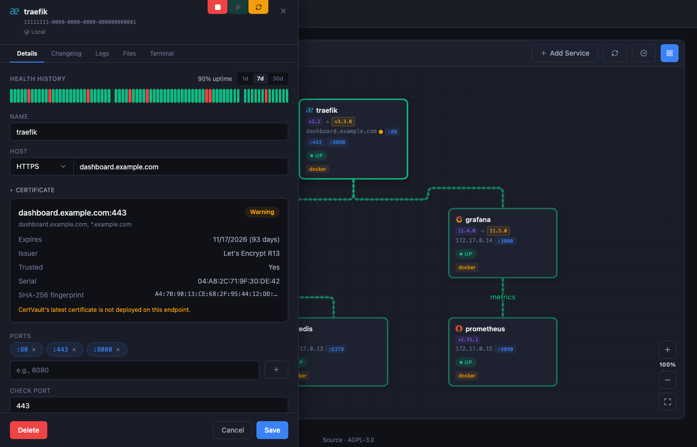
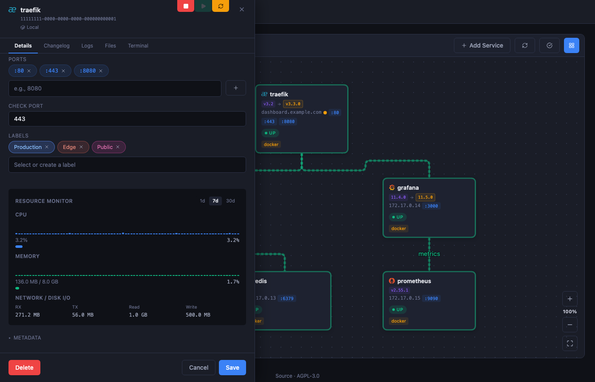
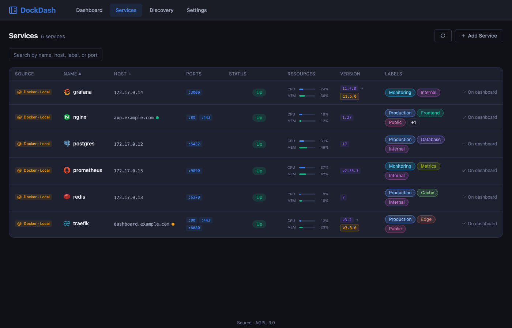
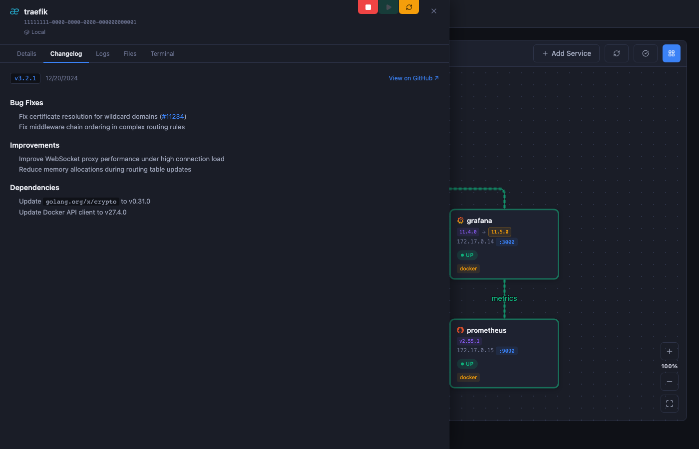
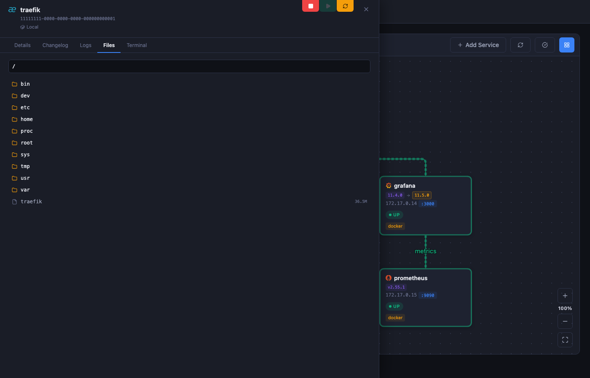
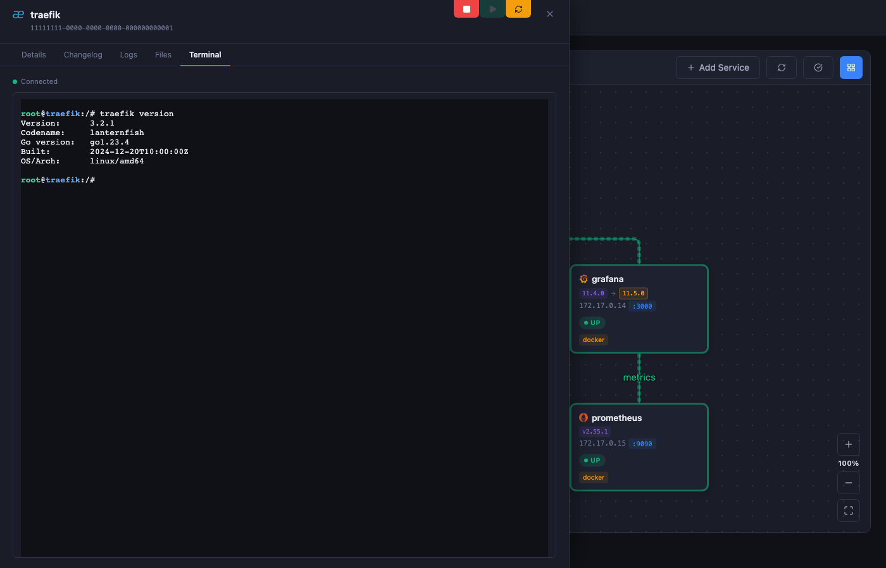

<p align="center">
  
</p>

[](https://github.com/dougmaitelli/DockDash/actions/workflows/ci.yml)
[](https://github.com/dougmaitelli/DockDash/releases)
[](https://github.com/dougmaitelli/DockDash/pkgs/container/dockdash)

A self-hosted, semantic-version-aware update monitor for pinned Docker images — with the changelog attached.

Most container dashboards answer one question: **did the image behind this tag get a new digest?** That is useful for floating tags such as `latest`, but it does not tell you that a service pinned to `1.25` can be upgraded to `1.26`.

DockDash checks the versions published by the image registry, compares them with the version you are actually running, and shows the GitHub release notes for the available version. You get a useful update such as **`1.25 → 1.26`**, not just “new image available” — without giving up reproducible, version-pinned deployments.

It also brings service discovery, uptime and resource monitoring, alerts, container management, and an interactive topology map into the same self-hosted dashboard.

## Update monitoring that understands versions

DockDash treats update checks differently depending on the image tag:

| Your image tag                                                      | How DockDash checks it                                                                                                                  |
| ------------------------------------------------------------------- | --------------------------------------------------------------------------------------------------------------------------------------- |
| A version tag such as `1.25`, `v1.25.3`, or `release-1.25.3-alpine` | Finds compatible tags in the registry and compares their numeric version components while preserving the tag's prefix and suffix family |
| A floating tag such as `latest`, `stable`, or `dev`                 | Falls back to comparing the locally running image digest with the registry digest                                                       |

When a newer version is found, DockDash:

1. Reports the running and available versions in the dashboard and notifications.
2. Resolves the source repository from OCI image metadata, GHCR coordinates, or the Docker Hub image name.
3. Fetches the matching GitHub release and displays its changelog alongside the service.

This makes version pinning the expected workflow rather than an obstacle. You decide when to upgrade, with the actual version change and release notes available before you touch the deployment.

## Documentation

- [Documentation website](https://dougmaitelli.github.io/DockDash/)
- [Configuration reference](docs/configuration/index.md)
- [Architecture](docs/ARCHITECTURE.md)
- [Contributing](CONTRIBUTING.md)
- [Security policy](SECURITY.md)
- [Release process](docs/RELEASING.md)
- [Code of Conduct](CODE_OF_CONDUCT.md)

## Features

- **Semantic-version-aware updates** — compares a pinned image tag with compatible registry tags and reports the actual version transition
- **Changelogs for available versions** — resolves the source repository and displays the matching GitHub release notes before you upgrade
- **Digest fallback for floating tags** — still detects changes to `latest`, `stable`, `dev`, and other non-version tags
- **Update notifications** — sends current-to-latest version details through any notification platform supported by Apprise
- **Multi-host Docker discovery** — scans one or more optionally named local or remote Docker daemons and imports containers and their exposed ports as services
- **Network discovery** — scans configurable CIDR ranges, with quick and deep scan modes, to find services not managed by Docker
- **Service management** — add services manually or import scan results, then search, filter, sort, edit, and choose which services appear on the dashboard
- **Health monitoring and history** — checks every service periodically and visualizes uptime over the last 1, 7, or 30 days
- **Resource monitoring and history** — tracks container CPU, memory, network, and disk I/O with current readings and historical charts
- **Container controls** — start, stop, and restart containers from the service drawer
- **Docker logs** — streams live container logs in the UI with timestamp parsing and ANSI stripping
- **File explorer** — browses a container's filesystem and supports viewing and editing text files in place
- **Terminal** — provides an interactive, theme-aware shell inside containers through xterm.js
- **Apprise notifications** — also alerts on service failures and recovery and configurable CPU or memory thresholds
- **Interactive topology canvas** — drag, group, and resize service nodes; draw and label connections; snap to grid; zoom, pan, and fit the topology to the screen
- **Themes and localization** — includes multiple built-in themes plus English and Brazilian Portuguese interfaces
- **OIDC authentication** — optional SSO through standard OpenID Connect providers such as Keycloak, Authentik, Authelia, and Google

## Screenshots

<table>
<tr>
<td width="33%">
<a href="screenshots/1.png"></a>
<p><em>Interactive canvas — services connected by drawn links, annotated with live health badges and update availability indicators.</em></p>
</td>
<td width="33%">
<a href="screenshots/2.png"></a>
<p><em>Service drawer (Details tab) — HTTPS configuration and live certificate details, including trust, expiration, issuer, and deployment status.</em></p>
</td>
<td width="33%">
<a href="screenshots/3.png"></a>
<p><em>Service drawer (Details tab) — live and historical CPU, memory, network, and disk usage for the selected container.</em></p>
</td>
</tr>
<tr>
<td width="33%">
<a href="screenshots/4.png"></a>
<p><em>Services table — flat list of all discovered services with live status, image version, ports, and certificate health.</em></p>
</td>
<td width="33%">
<a href="screenshots/5.png"></a>
<p><em>Service drawer (Changelog tab) — GitHub release notes fetched automatically for the running image version.</em></p>
</td>
<td width="33%">
<a href="screenshots/6.png"></a>
<p><em>Service drawer (Files tab) — browse a container's filesystem and view or edit text files directly in the UI.</em></p>
</td>
</tr>
<tr>
<td width="33%">
<a href="screenshots/7.png"></a>
<p><em>Service drawer (Terminal tab) — interactive shell inside any container, themed to match the active UI theme.</em></p>
</td>
</tr>
</table>

## Running with Docker Compose

```yaml
services:
  dockdash:
    image: dockdash
    container_name: dockdash
    restart: unless-stopped
    ports:
      - "3001:3001"
    environment:
      - LOG_LEVEL=info
      - NETWORK_CIDRS=192.168.0.1/24
    volumes:
      - /var/run/docker.sock:/var/run/docker.sock
      - dockdash-data:/app/data

volumes:
  dockdash-data:
```

A ready-to-use `docker-compose.yml` is included in the repository. Build and start it with:

```bash
docker compose up -d --build
```

The UI is available at `http://localhost:3001`.

## Security

DockDash is a powerful tool: it can exec into containers, read/write their filesystems, and start/stop them. **Treat the UI as equivalent to root access on your Docker host** and protect it accordingly.

### Authentication

DockDash ships with no authentication enforced by default. You **must** put it behind authentication before exposing it on any untrusted network. Two supported options:

1. **Built-in OIDC** — set `OIDC_ISSUER`, `OIDC_CLIENT_ID`, `OIDC_CLIENT_SECRET` (and `SESSION_SECRET`). Works with Keycloak, Authentik, Authelia, Google, etc.
2. **Reverse proxy** — front DockDash with Caddy / Traefik / nginx + an auth layer (Authelia, oauth2-proxy, basic auth, Tailscale, …). Bind DockDash only to `127.0.0.1` (or a private Docker network) so it isn't reachable directly:

   ```yaml
   ports:
     - "127.0.0.1:3001:3001"
   ```

### Docker socket exposure

Mounting `/var/run/docker.sock` gives DockDash (and anyone who reaches its UI) full control of the Docker daemon — which on most setups means root on the host. For a hardened deployment, route Docker access through a restricted proxy such as [tecnativa/docker-socket-proxy](https://github.com/Tecnativa/docker-socket-proxy) and point `DOCKER_HOSTS` at it:

```yaml
services:
  docker-proxy:
    image: tecnativa/docker-socket-proxy
    environment:
      CONTAINERS: 1
      IMAGES: 1
      NETWORKS: 1
      INFO: 1
      # Required for container controls / terminal / file explorer:
      POST: 1
      EXEC: 1
    volumes:
      - /var/run/docker.sock:/var/run/docker.sock:ro
    restart: unless-stopped

  dockdash:
    image: dockdash
    environment:
      - DOCKER_HOSTS=tcp://docker-proxy:2375
    # No docker.sock mount needed here
    depends_on:
      - docker-proxy
```

Adjust the `POST` / `EXEC` toggles to match the features you actually use — leave them off if you set `DISABLE_CONTAINER_CONTROLS=true`, `DISABLE_TERMINAL=true`, and `DISABLE_FILE_EXPLORER=true`.

## Configuration

DockDash is configured through environment variables. See the [configuration guide](docs/configuration/index.md) for the complete variable reference, Docker connectivity options, OIDC setup, notifications, feature controls, and deployment guidance.

## Development

Environment variables can be defined in a `.env` file at the project root. See [`.env.example`](.env.example) for available options.

```bash
pnpm install
pnpm dev             # starts both Vite (port 8081) and the Express server (port 3001)
pnpm dev:mock        # same as dev but with no Docker dependency — uses an in-memory database pre-seeded with six containers and 30 days of synthetic health and resource history
pnpm test            # run the server-side test suite
pnpm test:coverage   # run tests with V8 coverage report (output: coverage/)
pnpm typecheck       # type-check client and server
pnpm lint:fix        # auto-fix lint and formatting
```

See [CONTRIBUTING.md](CONTRIBUTING.md) for the complete development workflow, database migration guidance, required checks, and pull-request expectations.

## Community and support

- Use [GitHub issues](https://github.com/dougmaitelli/DockDash/issues) for reproducible bugs and feature proposals.
- Use [GitHub private vulnerability reporting](https://github.com/dougmaitelli/DockDash/security/advisories/new) for security issues.
- Review the [Code of Conduct](CODE_OF_CONDUCT.md) before participating.

Releases and container publishing are automated from semantic version tags. See the [release process](docs/RELEASING.md) for details.

## License

DockDash is licensed under the [GNU Affero General Public License v3.0](LICENSE).

Copyright 2026 Douglas Maitelli.
